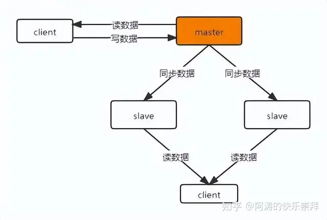
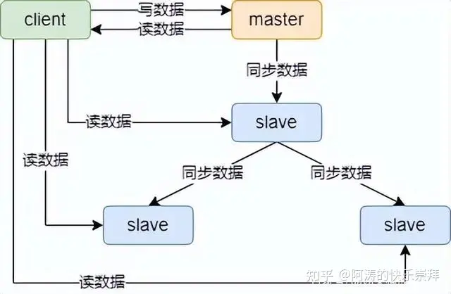
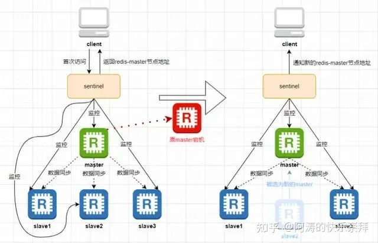
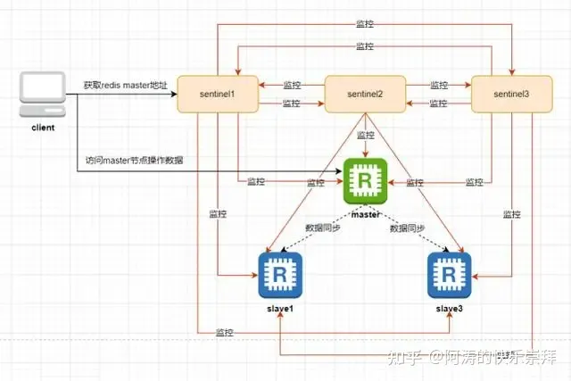

## redis

### redis 集群的几种实现方式

#### 主从模式

主从复制模式就是部署堕胎redis节点，只有一台节点是主节点master，其他节点都是从节点slave，也叫备份节点replica。只有master节点提供数据的事务性操作(增删改)，然后slave节点只提供读操作。所有slave节点的数据都是从master节点同步过来的，架构如下：

该图只是最简单的一种主从结构方式，所有的slave节点都挂在master节点上，这样做的好处是slave节点与master节点的数据延迟较小；缺点是如果slave节点数量很多，master同步一次数据的耗时就很长。针对这一问题，可以使用下图中的主从架构：

全量数据同步一般发生在slave节点初始化阶段，需要将master上的所有数据全部复制过来。全量同步的流程图如下：

1. slave节点根据配置的master节点信息，连接上master节点，并向master节点发送SYNC命令；
2. master节点收到SYNC命令后，执行BGSAVE命令异步将内存数据生成到rdb快照文件中，同时将生成rdb文件期间所有的写命令记录到一个缓冲区，保证数据同步的完整性；
3. master节点的rdb快照文件生成完成后，将该rdb文件发送给slave节点；
4. slave节点收到rdb快照文件后，丢弃所有内存中的旧数据，并将rdb文件中的数据载入到内存中；
5. master节点将rdb快照文件发送完毕后，开始将缓冲区中的写命令发送给slave节点；
6. slave节点完成rdb文件数据的载入后，开始执行接收到的写命令。

以上就是master-slave全量同步的原理，执行完上述动作后，slave节点就可以接受来自用户的读请求，同时，master节点与slave节点进入命令传播阶段，在该阶段master节点会将自己执行的写命令发送给slave节点，slave节点接受并执行写命令，从而保证master节点与slave节点的数据一致性。

#### 哨兵架构

哨兵（sentinel）在Redis主从架构中是一个非常重要的组件，是在Redis2.8版本引入的。它的主要作用就是监控所有的Redis实例，并实现master节点的故障转移。哨兵是一个特殊的redis服务，它不负责数据的读写，只用来监控Redis实例。

在哨兵模式架构中，client端在首次访问Redis服务时，实际上访问的是哨兵（sentinel），sentinel会将自己监控的Redis实例的master节点信息返回给client端，client后续就会直接访问Redis的master节点，并不是每次都从哨兵处获取master节点的信息。

sentinel会实时监控所有的Redis实例是否可用，当监控到Redis的master节点发生故障后，会从剩余的slave节点中选举出一个作为新的master节点提供服务，并将新master节点的地址通知给client端，其他的slave节点会通过slaveof命令重新挂载到新的master节点下。当原来的master节点恢复后，也会作为slave节点挂在新的master节点下。如下图：

一般情况下，为了保证高可用，sentinel也会进行集群部署，防止单节点sentinel挂掉。当sentinel集群部署时，各sentinel除了监控redis实例外，还会彼此进行监控。如下图：

