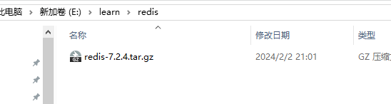

# redis 的基本概念

key - value 的数据库  键值对数据库

## NoSQL

sql 是关系型数据库，Nosql是非关系型数据库

差异：

- S - Structured 结构化
- NoSql ： 非结构化

常见的类似于redis的 kv键值型数据库

还有document文档型，用json文档存储

图类型的数据库，eno4j、tigherGraph


- R - relational 关联的
- Nosql 非关联结构
---
- SQL 查询
SQL select id, name, age from __table__ where id == ?
- 非SQL查询

像很多SQL数据库他们都用同一套的SQL语言逻辑，在mysql里面和oracle里面都可以用上面的SQL语句进行查询，但是想NoSQL数据库的查询语法格式不统一

比如：

redis : get user:1

MogoDB : db.users.find({_id:1})

elasticsearch : GET http://localhost:9200/users/1

---

- ACID 事务特性： 原子性，一致性，隔离性，持久性


Nosql数据库一般无法满足ACID，属于BASE类型

总结比较：


 # 认识redis
 Redis诞生于2009年全称是Remote Dictionary Server，远程词典服务器，是一个基于内存的键值型NoSQL数据库

 ## redis 特征
 - 键值型，value支持多种不同的数据库，功能丰富
 - 单线程，每个命令都具备原子性（6.0仅仅是对网络处理那块是多线程的，而核心的命令执行这一块还是单线程）
- 低延迟，速度快（基于内存、IO多路复用、良好的编码-基于c写的，写得很好）
- 支持数据持久化
- 支持主从集群、分片集群
- 支持多语言客户端


# 安装redis
基于Linux服务器来部署项目

redis官网：https://redis.io/

## 单机安装redis

#### step1

因为redis是基于c语言编写的，所以首先需要安装redis所需要的gcc依赖：
```shell
yum install -y gcc tcl
```

#### step2
上传安装包并进行解压

这里从官网上下载redis的tar.gz包，然后上传到自己的云服务器上

```shell
# 这里要用的是shell的rz命令   如果没安装就先安装lrzsz包
yum -y install lrzsz

rz # 选择需要上传的内容
```

这里一般是放在/usr/local/src 目录下的，这个目录一般清苦选哪个下就是用来放我们的安装文件的

然后进入这个文件夹下，运行
```shell
make && make install
```
如果没出错，过一会就安装成功了


默认的安装路径是再 /usr/local/bin 目录下：


redis-server： redis的服务端的启动脚本

redis-cli： redis命令行客户端

redis-sentinel： 是redis的哨兵的启动脚本

## 启动
redis的启动方式有很多种：
- 默认启动
```shell
redis-server
```

现实这个就启动成功了  这里属于是前台启动
- 指定配置启动
如果要让redis以后台方式启动就要修改redis的配置文件，redis的配置文件就再我们解压的redis的安装包下，名字叫做redis.conf

```shell
# 要修改这个配置文件，我们最好先做一个备份
cp redis.conf redis.conf.bak

# 修改redis.conf 文件
# 可以修改的地方很多很多，这里我们首先要修改的如下：

# 允许访问的地址，默认是127.0.0.1，会导致只能在本地访问。修改为0.0.0.0则可以在任意IP访问，身缠环境不要设置为0.0.0.0
bind 0.0.0.0
# 守护进程  修改为yes 即可后台运行
daemonize yes
# 密码，设置后访问redis必须输入密码
requirepass 123

### 其他的一些可以修改的配置
# 监听端口
port 6379

# 工作目录 默认是当前目录，也就是运行redis-server命令所处的目录，日志、持久化等文件会保存在这个目录中
dir .

# 数据库数量，设置为1，代表只是用一个库，默认有16个库，编号为0-15
databases 1

# 设置redis能够使用的最大内存
maxmemory 512mb
# 日志文件 默认为空，不记录日志可以指定日志文件名
logfile "redis.log"

## 启动redis ########################
# 进入redis安装目录
cd /usr/local/src/redis-x.x.x
# 启动
redis-server redis.conf

## 停止服务 ###########################
# 用redis-cli 执行shutdown命令就可以停止redis服务了
# 因为设置了密码  所以需要通过-u来指定密码
redis-cli -u 123 shutdown
```
- 开机自启
我们可以通过配置来实现开机自启

首先新建一个系统服务文件
```shell
vim /etc/systemd/system/redis.service
```
内容如下：
```conf
[Unit]
Description=redis-server
After=network.target

[Service]
Type=forking
ExecStart=/usr/local/bin/redis-server /usr/local/src/reids-x.x.x/redis.conf
PrivateTmp=true

[Install]
WantedBy=multi-user.target
```
然后重载系统服务：
```shell
systemctl daemon-reload
```
现在我们就可以用下面这组命令来操作redis了
```shell
# systemctl 的一些基础使用
systemctl start redis
systemctl status redis
systemctl stop redis
systemctl restart redis
systemctl enable redis # 这个就达到了开机自启的功能 了
```

## redis 客户端
- 命令行客户端
redis安装好了之后就自带了命令行客户端：redis-cli，使用方式如下：
```shell
redis-cli [options] [commonds]
```
常见的options有：
- -h 127.0.0.1 指定要连接的redis结点的IP地址，默认是127.0.0.1
- -p 6379 指定要连接的redis结点的端口，默认是6379
- -a 123 指定redis的访问密码

其中commonds就是redis的操作命令：
- ping: 与redis服务端做心跳测试，服务端正常会返回pong

不指定commonds的时候，会进入redis-cli的交互控制台

---

- 图形化桌面客户端

---

- 编程客户端

### redis数据结构介绍
redis是一个key-vale的数据库，key一般是string类型，但是value有很多
- string
- Hash 哈希表
- List 有序数组
- Set  无序集合
- SortedSet 有序可排序的集合
- GEO   地理坐标 经度纬度
- bitMap 
- HyperLog 

redis.io/commands

help 命令

### redis 通用命令
通用命令是部分数据类型都可以使用的指令，常见都有：
- keys: 查看符合模板的所有key
通过help [command] 可以查看一个命令的具体用法

```shell
127.0.0.1:6379> help keys

  KEYS pattern
  summary: Returns all key names that match a pattern.
  since: 1.0.0
  group: generic
```
- del: 删除一个指定的key
- exists: 判断key是否存在
- expire: 给key设置一个有效期，有效期到期后该key会被自动删除
- TTL: 查看一个key的剩余有效期

### string 类型常用命令
string类型也就是字符串类型，是redis中最简单的存储类型。

其中value是字符串，不过根据字符串的格式不同又可以分为三类：
- string: 普通字符串
- int: 整数类型，可以做自增自减的操作
- float: 浮点类型，可以自增自减

string的常见命令：
- **set**: 添加或者修改已经存在的一个string类型的键值对
- **get**: 根据key获取的string类型的value
- **mset**: 批量添加多个string类型的键值对
- **mget**: 根据多个key获取多个string类型的value
- **incr**: 让要给整型的key自增1 - decr
- **incrby**: 让一个整型的key自增并指定步长 (such as: incrby num 2 让num值自增2)
- **incrbyfloat: 让一个浮点型的数字自增指定步长
- **setnx**: 添加一个string类型的键值对，前提是这个key不存在，否则不执行
- **setex**: 添加一个stirng类型的键值对，并指定有效期

---
redis没有类似mysql中的table概念，我们要如何区分不同类型的key呢？

    redis中的key允许多个单词形成层级结构，可以用多个单词，中间用:隔开，格式如下：
      项目名:业务名:类型:id

如果value是一个golang的结构体，可以将这个数据序列化成json字符串再进行存储

---

### Hash 类型
hash类型也叫做散列，其value是一个无需字典，类似于java中的HashMap的结构(go 中的 map)

string结构是将结构体序列化为json字符串后进行存储，如果要修改某个字段就会很不方便

hash结构可以将对象中的每个字段独立存储，针对单个字段做curd

Hash常见命令：
- HSET key field value: 添加或者修改hash类型key中field的值
- Hget key field: 获取一个hash类型key的field值
- hmset: 批量添加多个hash类型key的field值
- hmget: 批量获取多个...
- hgetall: 获取一个hash类型的key中的所有的field和value
- hkeys: 获取一个hash类型的key中的所有field
- hvals: 获取一个hash类型的key中的所有value
- hincrby: 让一个hash类型key的字段值自增并指定步长
- hsetnx: 添加一个hash类型的key的field值，前提是这个field不存在否则不执行

### List 类型
Redis中的List类型可以看作一个双向链表的结构，既支持正向检索，也支持反向检索

特征：
- 有序
- 元素可以重复
- 插入和删除块
- 查询速度一般

常见命令：
- lpush key element: 向列表左侧插入一个或者多个元素
- lpop key: 移除并返回列表左侧的第一个元素，没有则返回nil
- rpush key element: 向列表右侧插入一个或者多个元素
- rpop key: 移除并返回列表右侧第一个元素
- lrange key star end: 返回一段角标范围内的所有元素
- blpop和brpop: 与lpop和rpop类似，只不过在没有元素是等待指定时间，而不是直接返回nil

---

如何用list结构模拟一个栈

    左进左出 或者 右进右出

如何用list结构模拟一个队列

    左进右出 或者 右进左出

如何用list结构模拟一个阻塞队列

    入口出口不同边
    出队采用BLPOP或者BRPOP

---

### set 类型
可以看作一个value为null的hashmap，因为也是一个哈希表，也和hashset类似的特征

特征：
- 无序
- 元素不可重复
- 查找快
- 支持交集、并集、差集等功能

常见命令：
- sadd key member: 向set中添加一个或者多个元素
- srem key: 移除set中的指定元素
- scard key : 返回set中的元素个数
- sismember key member: 判断一个元素是否存在于set中
- smembers: 获取set中的所有元素
- sinter key1 key2 ... : 求key1 和 key2 的交集
- sdiff key1 key2 ... :  求key1 和 key2 的差集
- sunion key1 key2 ... : 求key1 和 key2 的交集

### sortedset 类型
看名字就是可排序的集合，底层数据结构是 sortedset中的每一个元素都带有score属性，可以基于score属性对元素进行排序，底层的实现是一个跳表加上hash表

特性：
- 可排序
- 元素不重复
- 查询速度快

sortedset的常见命令：
- zadd key score member: 添加新的member或者修改已有member的score
- zrem key member : 删除sorted set 中的一个元素
- zscore key member : 获取 sset 中 member 对应的 score
- zrank key member : 获取sorted set 中的指定元素的排名
- zcard key : 获取sset 中的元素个数
- zcount key min max : 统计score值再给定范围内的所有元素的个数
- zincrby key increment member : 让sorted set中的指定元素自增，步长为指定的incrememt 值
- zrange key min max : 按照score排序后获取指定排名范围内的元素
- zrangebyscore key min max : 按照score排序后获取指定score范围内的元素
- zdiff zinter zunion : 差、交、并

## redis的各种语言的客户端
https://redis.io/clients

## redis 备份

### RDB
fork 子进程进行备份  不影响进程运行

### AOF
1. 写入数据进redis,然后flushdb+shutdown服务器
2. 新生成了dump和aof
3. 备份新生成的aof.bak,然后删除dump/aof再看恢复
4. 重启redis然后重新加载试试？
5. 停止服务器,拿出我们的备份修改后再重新启动服务器看看