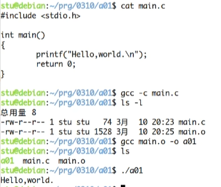
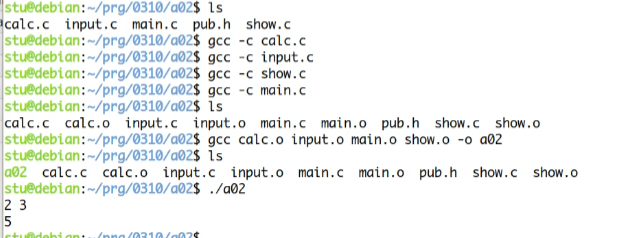

## linux中make命令的逻辑

在linux中，我们写一个c文件，要将一个c语言的源代码编译成可执行的二进制文件的流程如下：

通过gcc先编译成.o文件，再编译成二进制

当我们要编译(链接多个C文件成二进制的时候)流程如下



### make的概念
make实际上的意思也就是制作，make命令直接用了就是这个意思，就比如要做出 a.txt 文件就可以执行 `make a.txt`

但是如果直接输入这条命令，它不会有任何作用，因为make这个命令本身并不知道要如何做出a.txt，需要有人告诉它，如何调用其他命令完成这个目标。

比如: 假设文件 a.txt 依赖于 b.txt 和 c.txt，是后面两个文件连接(cat 命令)的产物，那么make需要知道如下的规则

```shell
a.txt:b.txt c.txt # 冒号前面的表示目标是什么，冒号后面表示需要依赖什么
    cat b.txt c.txt > a.txt
```

也就是说，make a.txt 这条命令的背后实际上是分为两步：第一步，确认b.txt 和 c.txt 两个文件必须已经存在，第二部就是使用cat命令将这两个文件合并，输出为新的文件

像这样的规则都写在一个叫做makefile的文件中，make命令依赖于这个文件进行构建，或者用命令行参数指定为其他的文件名

```shell
make -f rules.txt

make --file=rules.txt
```

### Makefile的概述
makefile文件由一系列规则 rules 构成，每条规则的形式如下：

```shell
<target>:<prerequisites>
[tab] <commands>
```
上面第一行冒号前面的部分，叫“目标"(target)，冒号后面的部分叫做”前置条件"(prerequisites);第二行必须由一个 tab 键起首，后面跟着"命令"(commands)。"目标"是必需的，不可省略:"前置条件"和"命令"都是可选的，但是两者之中必须至少存在一个。"

每条规则就明确两件事:构建目标的前置条件是什么，以及如何构建。下面就详细讲解，每条规则的这三个组成部分。

#### target 目标
一个目标就构成一个规则，目标通常是文件名，知名make命令所要构建的对象，比如上文的a.txt。目标可以是一个文件名也可以是多个文件名。之间要通过空格分隔

除了文件名,目标还可以是某个操作的名字,这称为"伪目标"(phony target)。.
```shell
clean:
    rm *.0.
```
上面代码的目标是 clean，它不是文件名，而是一个操作的名字，属于"伪目标"，作用是删除对象文件。
```shell
make clean
```
但是，如果当前目录中，正好有一个文件叫做clean，那么这个命令不会执行。因为 Make 发现 clean 文件已经存在，就认为没有必要重新构建了，就不会执行指定的rm 命令。

为了避免这种情况，可以明确声明 clean 是"伪目标"，写法如下。"

```makefile
.PHONY: clean

clean:
    rm *.0 temp
```
声明 clean 是"伪目标"之后，make 就不会去检查是否存在一个叫 clean 的文件,而是每次运行都执行对应的命令。像`.PHONY` 这样的内置目标名还有不少，可以查看手册。

如果 Make 命令运行时没有指定目标，默认会执行 Makefile 文件的第一个目标。
make 
上面代码执行 Makefile 文件的第一个目标。


#### prerequisites 前置条件

前置条件通常是一组文件名，之间用空格分隔。它指定了"目标"是否冲i性能构建的判断标准：只要有一个前置文件不存在，或者有过更新（前置文件的last-modification时间戳比目标的时间戳新），目标就需要重新构建

#### 命令
命令(commands)表示如何更新目标文件,由一行或多行的 shell 命令组成它是构建"目标"的具体指令，它的运行结果通常就是生成目标文件。。每行命令之前必须有一个tab键。如果想用其他键，可以用内置变量.RECIPEPREFIX声明

这里我们写一个makefile
```makefile
a01: main.o
	gcc main.o -o a01

main.o: main.c
	gcc main.c -c

clean:
    rm main.o a01
```
这里我们直接输入make，它会帮我们编译 a01，如果我们输入make clean 就会执行clean 下面对应的指令


