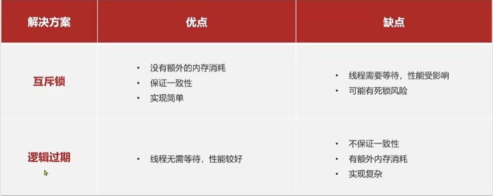

# 企业应用

应用场景：
- redis的共享session应用 (比如像短信登录中验证码的保存，登录状态的保存)
- 商户查询缓存，企业的缓存使用技巧 (缓存雪崩、穿透等问题的解决)
- List的点赞列表，sortedset的点赞排行榜
- 优惠券秒杀 (redis的计数器，lua脚本redis，分布式锁。redis的三种消息队列)
- 基于set集合的关注、取关、共同关注、消息推送等功能
- 附近的商户，Redis的GeoHash的应用
- 用户签到、uv统计 (bitMap 数据统计功能， hyperloglog的统计功能)

---

### 基于session实现登录

校验手机号

生成验证码

存储验证码

发送验证码

用户填入验证码

比较验证码

登录成功存储session状态

---

## 缓存使用
缓存就是数据交换的缓冲区，是贮存数据的临时地方，一般读写性能较高

 缓存的作用：
 - 降低后端负载
 - 提高读写效率，降低响应时间

 缓存的成本：
 - 数据一致性成本
 - 代码维护成本
 - 运维成本

缓存更新策略
- 内存淘汰
不用自己维护，利用redis的内存淘汰机制，当内存不足的时候就自动淘汰部分数据，下次查询的时候更新缓存

一致性比较差，但是几乎没有维护成本

- 超时剔除
给缓存书记添加TTL时间，到期后自动删除缓存，下次查询时更新缓存。

一致性一般，维护成本较低

- 主动更新
编写业务逻辑，在修改数据库的同时，更新缓存

一致性比较好，成本比较高

业务场景：
- 低一致性需求，使用内存淘汰机制。
- 高一致性需求，就用主动更新，并以超时剔除作为兜底方案

主动更新的策略：
- 更新数据库的同事更新缓存
- 缓存与数据库整合为一个服务，由服务来维护一致性。调用者调用该服务无需关心缓存一致性问题
- 调用者只操作缓存，由其他线程异步将缓存数据持久化到数据库，最终保证数据的一致性

操作缓存和数据库时由三个问题需要考虑：
1. 删除缓存还是更新缓存？
- 更新缓存：每次更新数据库都更新缓存，无效写擦欧总比较多
- 删除缓存：每次更新数据库让缓存失效，查询的时候再更新缓存 *

2. 如何保证缓存与数据库的操作的同事成功或者失败

### 缓存穿透
缓存穿透是指客户端请求的数据再缓存中和数据库中都不存在，这样的缓存永远不会生效，这些请求都会打到数据库

解决方案：
- 缓存空对象
实现简单，维护方便

缺点：额外的内存消耗，可能造成短期不一致

- 布隆过滤
内存占用少，没有多余的key

缺点：实现复杂，存在误判的可能

- 增强id复杂度，避免被猜测id规律

- 做好数据的基础格式校验

- 加强用户权限校验

- 做好热点参数的限流

### 缓存雪崩
缓存雪崩是指再同一时段内缓存key同时失效或者redis服务宕机，导致大量请求到达数据库，带来巨大压力。

解决方案：
- 不同的key的TTL添加随机值
- 利用redis集群提高服务的可用性
- 给缓存业务添加降级限流策略
- 给业务添加多级缓存

### 缓存击穿
缓存击穿问题也叫做热点key问题，就是一个高并发访问并且缓存重建业务比较复杂的key突然失效了，无数的请求访问会再瞬间给数据库带来巨大的冲击。

常见解决方案：
- 互斥锁

- 逻辑过期

### 分布式锁
用redis的setnx命令互斥创建  即可完成锁的功能

结束的时候del就行

然后常见的问题就是，要记得设置过期时间，如果无法判断需要运行多长就用一个goroutine延长过期时间